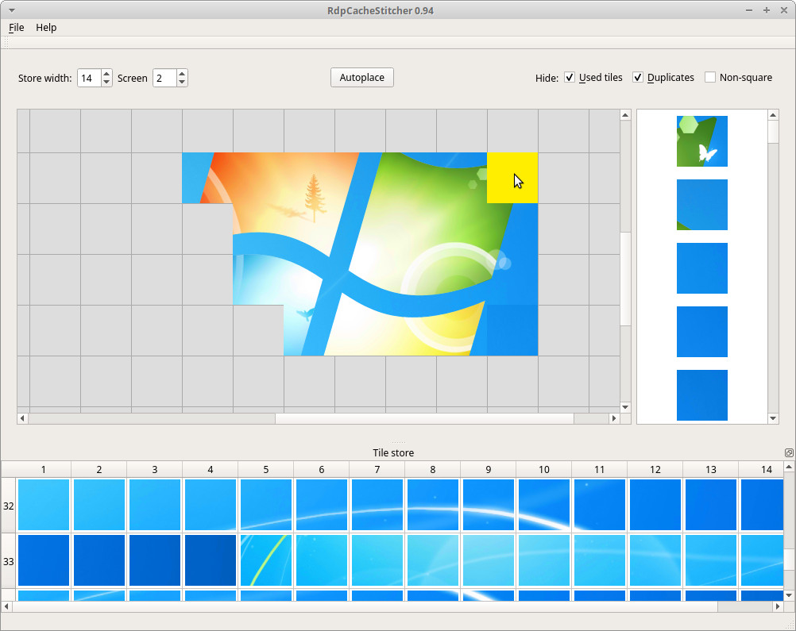

# RdpCacheStitcher

_RdpCacheStitcher_ is a tool that supports forensic analysts in reconstructing useful images out of RDP cache bitmaps. Using raw RDP cache tile bitmaps extracted by tools like e.g. ANSSI's _BMC-Tools_ (https://github.com/ANSSI-FR/bmc-tools) as input, it provides a graphical user interface and several placement heuristics for stitching tiles together so that meaningful images or even full screenshots can be reconstructed.



## Features

* Show hints where a selected tile might fit best visually
* Provide an ordered list of tiles that could best be placed visually for a selected empty cell
* When hovering over a tile, preview how it might look when placed 
* Work with multiple screens per case
* Options to exclude already used, non-square or duplicate tiles
* Crop and export all reconstructed images belonging to a case as PNG
* The sub-window with all available tiles is dockable, i.e. it can be its own window and move to a different display
* Keep individual notes per screen

## Manual

A complete manual with a description of all features and the workflow for a typical use case can be found in the document [RdpCacheStitcher_manual.pdf](RdpCacheStitcher_manual.pdf).

## Installing prerequisites and starting RdpCacheStitcher

You can download prebuilt binaries of _RdpCacheStitcher_ for 64bit Linux and Windows at https://github.com/BSI-Bund/RdpCacheStitcher/releases/. For each system you have to install one necessary prerequisite first.

### Ubuntu

* Install the package _libqt5widgets5_: ```sudo apt install libqt5widgets5```
* Run ```RdpCacheStitcher```

### Windows

* Install the Microsoft Visual C++ 2017 Redistributable (64 bit) package on your Windows machine (https://aka.ms/vs/16/release/vc_redist.x64.exe)
* Unzip the _RdpCacheStitcher_ archive anywhere on your system
* Run ```RdpCacheStitcher.exe```

---

## Build from source

If you want to build _RdpCacheStitcher_ from source, you need to install the Qt development framework first. Then, simply open the file `RdpCacheStitcher.pro` in Qt Creator and build the project from there.

---

## License

RdpCacheStitcher is copyright 2020 Bundesamt fuer Sicherheit in der Informationstechnik (BSI)

RdpCacheStitcher is free software: you can redistribute it and/or modify it under the terms of the GNU Lesser General Public License as published by the Free Software Foundation, either version 3 of the License, or (at your option) any later version.

RdpCacheStitcher is distributed in the hope that it will be useful, but WITHOUT ANY WARRANTY; without even the implied warranty of MERCHANTABILITY or FITNESS FOR A PARTICULAR PURPOSE. See the GNU Lesser General Public License for more details.

You should have received a copy of the GNU Lesser General Public License along with RdpCacheStitcher. If not, see <https://www.gnu.org/licenses/>.

RdpCacheStitcher uses the open source (L)GPL v3 version of Qt, which you can download at http://download.qt.io/archive/qt/.
